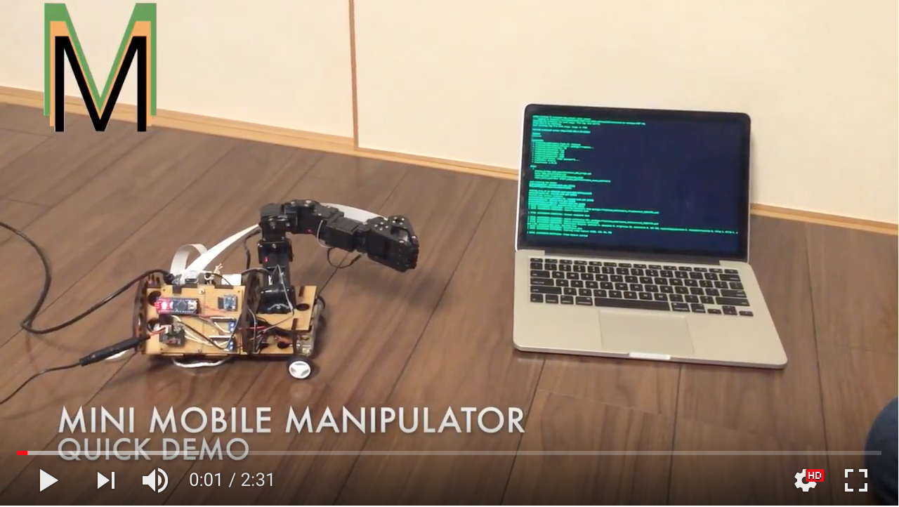
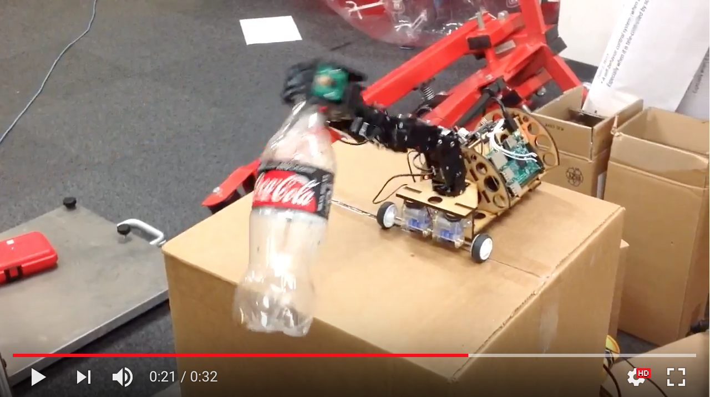
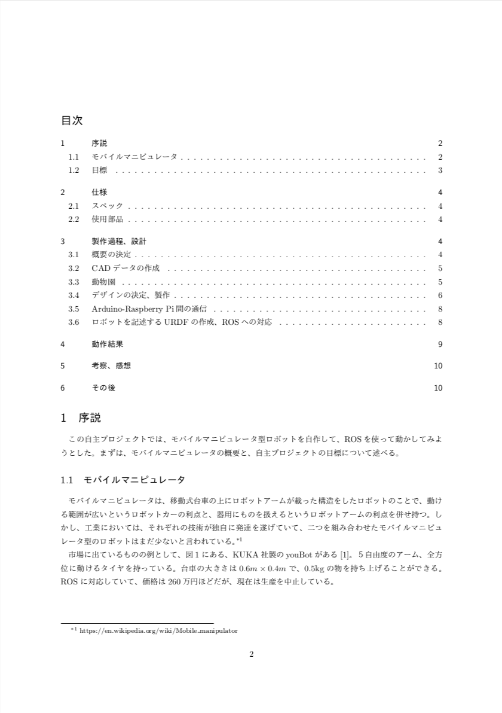

# Mini Mobile Manipulator
storage for Individual Projects(自主プロ) at UTokyo

## [Progress is documented in the wiki.](https://github.com/Yasu31/fantastic-octo-parakeet/wiki)

## demo
general run-through of robot

pick up trash(kind of)

## documents
### final report for school project(Japanese)

## To move the robot(as of Jan.10)
* make sure to be on the same network as robot(NOT eduroam)
* For VM Ubuntu, set ROS_MASTER_URI to http://(IP of raspi):11311 inside ~/.bashrc, set robot_ip on moveit_planning_execution.launch to (IP of raspi).
* `roslaunch mmm_control robot.launch` on RasPi, which launches roscore, handles communication between Arduino, and audio, and ...
* `roslaunch mmm_moveit_config moveit_planning_execution.launch` which starts MoveIt and RVIZ.
* `rosrun image_view image_view image:=/raspicam_node/image _image_transport:=compressed` to view camera feed

careful- the MMM currently sources the  setup file  for the ice-cream catkin_ws!
